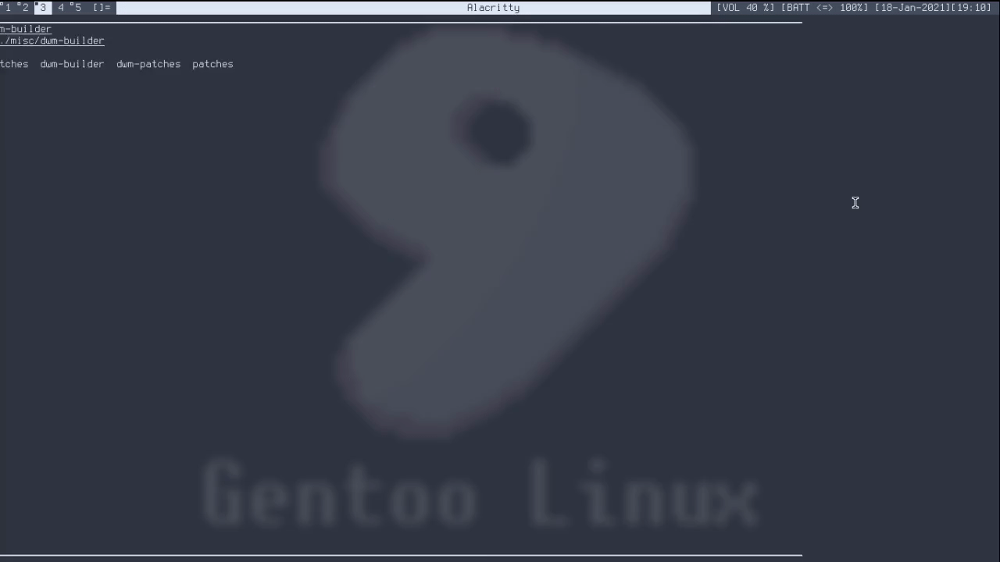
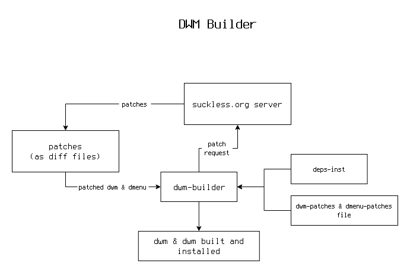

# dwm-builder
A script to effortlessly fetch, patch and build suckless' dwm and dmenu using POSIX shell (for Linux and BSD).

## Install
### Dependencies

- git
- make
- wget
- fontconfig
- libX11
- libXft
- Xinerama and libXinerama (for multimonitor support)

### Process
Run `./dwm-builder` or `sh ./dwm-builder` in terminal to run and follow the process.

## Extending the experience
### Flow Diagram (for nerds)

### Adding new patches
To add/modify patches for **dmenu** and **dwm** in `dmenu-patches` and `dwm-patches` by adding or changing the URLs within the file. The purpose of these files is to simply store the URLs of the patches.

## Future Upgrades (to be planned)

- [ ] Automated process of adding, checking and updating dependencies before proceeding regardless of OS.
- [ ] An auxilary status bar for dwm
- [ ] Ability to scalarly integrate other suckless utilities like sxiv, surf, etc.
